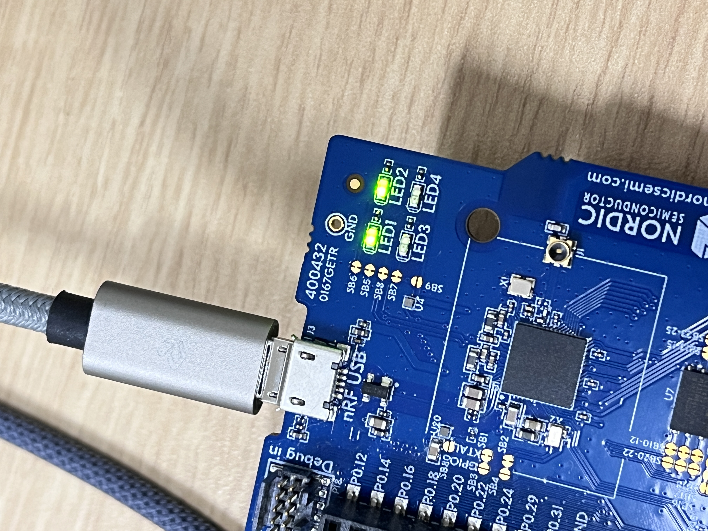
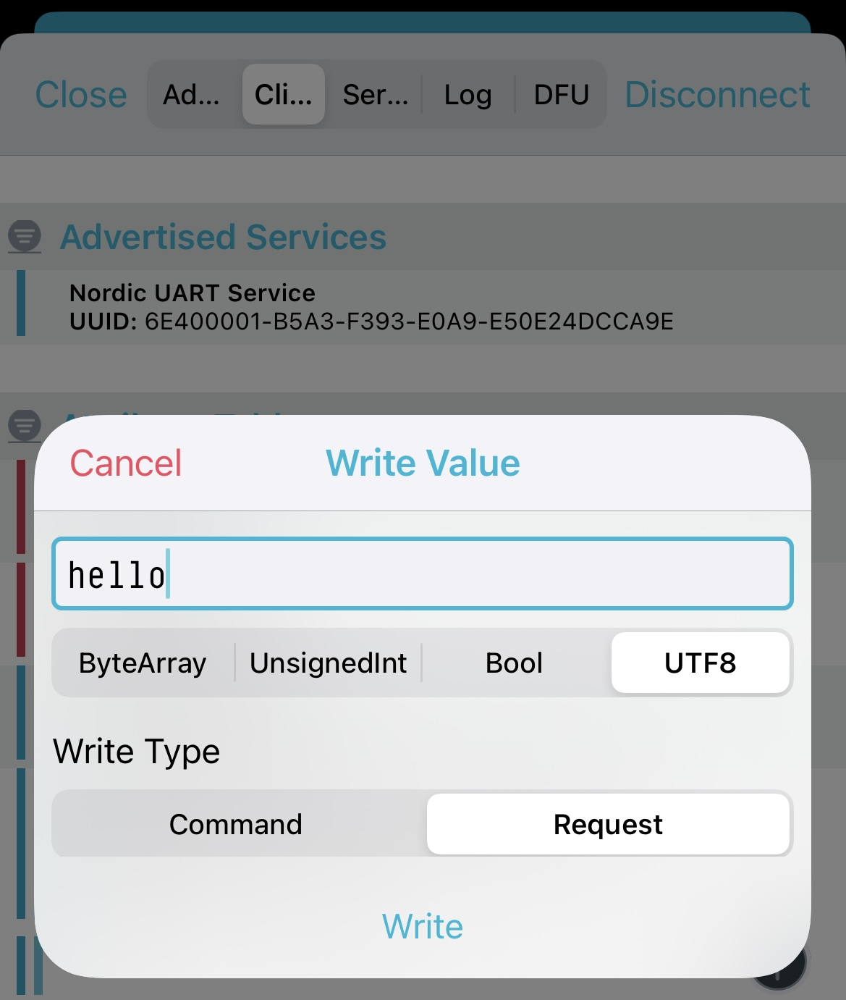
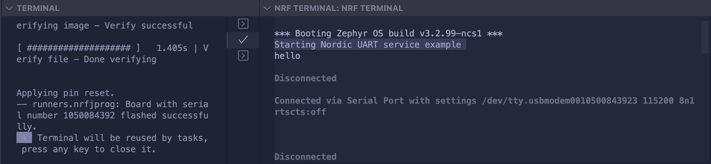

After programming the sample to your development kit, complete the following steps to test it:

1. Connect the device to the computer to access UART 0. If you use a development kit, UART 0 is forwarded as a COM port (Windows) or ttyACM device (Linux) after you connect the development kit over USB. 

2. Reset the kit. Press the RESET button on development kit(sw5).

3. Observe that LED 1 is blinking and that the device is advertising with the device name that is configured in 'CONFIG_BT_DEVICE_NAME'.

4. Observe that the text "Starting Nordic UART service example" is printed on the COM listener running on the computer.

5. Connect to the device using nRF Connect for Mobile. Observe that LED 2 is on.

6. Optionally, pair or bond with the device with MITM protection. This requires using the passkey value displayed in debug messages. See 'peripheral_uart_debug' for details on how to access debug messages. To confirm pairing or bonding, press Button 1 on the device and accept the passkey value on the smartphone.

7. In the application, observe that the services are shown in the connected device.

8. Select the UART RX characteristic value in nRF Connect. You can write to the UART RX and get the text displayed on the COM listener.

9. Type 'hello' and tap 'SEND'. Verify that the text "hello" is displayed on the COM listener.

